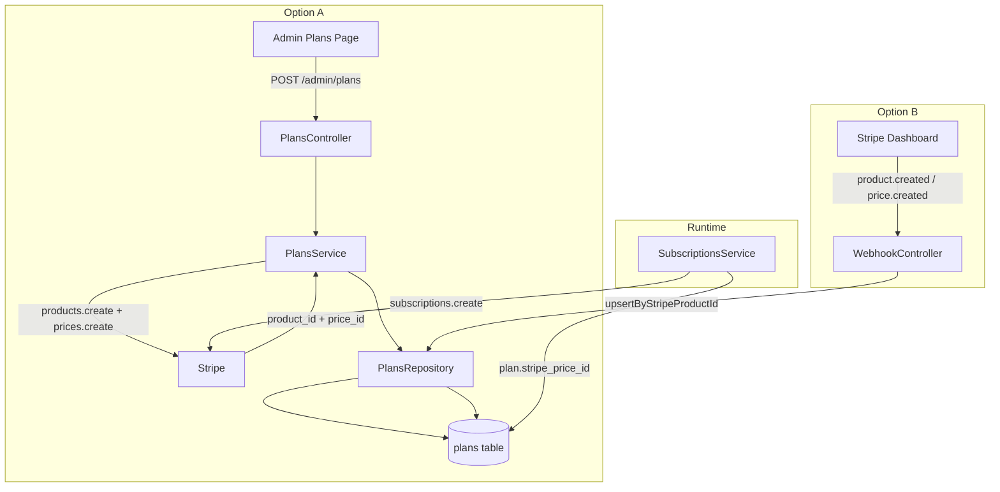

# Design Document — plan-sync

## Overview

The plan-sync feature introduces a dual-source architecture for managing SaaS billing plans. Currently, `stripe_price_id` is buried inside the `features` JSON column, there is no `stripe_product_id` stored anywhere, and the only way to populate plans is a one-time seed script.

This design enables two complementary flows that operate simultaneously:

- **Option A (App Dashboard as source of truth):** An admin creates or edits a plan in the Taxmic dashboard. The backend calls Stripe to create the product and price, receives both IDs, and persists them to the `plans` table.
- **Option B (Stripe Dashboard as source of truth):** An admin creates products and prices directly in the Stripe Dashboard with required metadata. Stripe fires webhooks. The backend receives them and upserts the plan in the database.

Both options share the same database migration and the same runtime price-lookup path in `subscriptions.service.ts`. The DB is always the source of truth at runtime — the subscription service always reads `stripe_price_id` from the `plans` table regardless of which option populated it.

---

## Architecture



The idempotency layer in `stripe-subscriptions-webhook.controller.ts` (signature verification + `webhook_events` upsert) is reused unchanged for the four new webhook event types.

---

## Components and Interfaces

### Backend — New Files

**`apps/api/src/shared/middleware/require-admin.ts`**

```typescript
import { Request, Response, NextFunction } from 'express';
import { AppError } from '../utils/errors';

export function requireAdmin(req: Request, _res: Response, next: NextFunction) {
  if (req.user?.role !== 'admin') {
    return next(new AppError('Forbidden', 403, 'FORBIDDEN'));
  }
  next();
}
```

Reads `req.user.role` which is already populated by the `authenticate` middleware from the JWT payload (`JwtPayload.role: string`). Applied after `authenticate` on all admin plan routes.

---

**`apps/api/src/modules/billing/subscriptions/plans.controller.ts`**

Follows the same class-with-arrow-methods pattern as `subscriptions.controller.ts`.

| Method | Route | Delegates to |
|---|---|---|
| `listAllPlans` | `GET /admin/plans` | `plansService.listAllPlans()` |
| `createPlan` | `POST /admin/plans` | `plansService.createPlan(req.body)` |
| `updatePlan` | `PATCH /admin/plans/:id` | `plansService.updatePlan(req.params.id, req.body)` |
| `deactivatePlan` | `DELETE /admin/plans/:id` | `plansService.deactivatePlan(req.params.id)` |

Returns HTTP 201 on create, HTTP 200 on all others.

---

**`apps/api/src/modules/billing/subscriptions/plans.routes.ts`**

```typescript
router.get('/admin/plans', authenticate, requireAdmin, plansController.listAllPlans);
router.post('/admin/plans', authenticate, requireAdmin, validate(createPlanSchema), plansController.createPlan);
router.patch('/admin/plans/:id', authenticate, requireAdmin, validate(updatePlanSchema), plansController.updatePlan);
router.delete('/admin/plans/:id', authenticate, requireAdmin, plansController.deactivatePlan);
```

No `tenantContext` middleware — admin routes are not tenant-scoped.

---

**`apps/web/src/pages/billing/admin-plans.tsx`**

Single-page component using `DashboardLayout` (per layout governance). Renders a plan table with Create / Edit / Deactivate actions. Form state is managed locally with controlled inputs. Calls `billingApi` methods and re-fetches the plan list on success.

---

### Backend — Modified Files

**`apps/api/src/modules/billing/subscriptions/plans.repository.ts`** — add write methods (see Data Models section).

**`apps/api/src/modules/billing/subscriptions/plans.service.ts`** — add `createPlan`, `updatePlan`, `deactivatePlan`, `listAllPlans` (see Data Models section).

**`apps/api/src/modules/billing/subscriptions/subscriptions.validation.ts`** — add `createPlanSchema` and `updatePlanSchema`.

**`apps/api/src/modules/billing/subscriptions/stripe-subscriptions-webhook.controller.ts`** — add four new cases to the existing `handleSubscriptionEvent` switch.

**`apps/api/src/modules/billing/subscriptions/subscriptions.service.ts`** — update three `stripe_price_id` lookup call sites.

**`apps/api/src/modules/billing/index.ts`** — import and mount `plansRouter`.

**`apps/web/src/features/billing/api/billing-api.ts`** — add four admin plan methods.

**`apps/web/src/features/billing/types.ts`** — add `stripe_product_id` and `stripe_price_id` to `Plan`.

**`apps/web/src/App.tsx`** — add route for `/billing/admin/plans`.

---

## Data Models

### Database Schema Changes (`packages/database/prisma/saas.prisma`)

Add to the `plans` model:

```prisma
stripe_product_id  String?  @db.VarChar(255)
stripe_price_id    String?  @db.VarChar(255)

@@index([stripe_product_id])
@@unique([stripe_price_id])
```

The `features` JSON column is retained for other feature flags. `stripe_price_id` is promoted to a dedicated column so it is queryable and indexable.

### Migration File

New file: `packages/database/prisma/migrations/YYYYMMDDHHMMSS_plan_sync_stripe_columns/migration.sql`

```sql
ALTER TABLE plans ADD COLUMN stripe_product_id VARCHAR(255);
ALTER TABLE plans ADD COLUMN stripe_price_id VARCHAR(255);

CREATE INDEX idx_plans_stripe_product_id ON plans(stripe_product_id);
CREATE UNIQUE INDEX idx_plans_stripe_price_id ON plans(stripe_price_id);
```

### Plans Repository — Full Interface After Changes

```typescript
class PlansRepository {
  // Existing
  findAll(): Promise<Plan[]>                          // active only, ordered by sort_order
  findById(id: string): Promise<Plan | null>

  // New
  findAll_admin(): Promise<Plan[]>                    // all plans including inactive
  create(data: CreatePlanData): Promise<Plan>
  update(id: string, data: UpdatePlanData): Promise<Plan>
  deactivate(id: string): Promise<Plan>
  findByStripeProductId(stripeProductId: string): Promise<Plan | null>
  upsertByStripeProductId(stripeProductId: string, data: UpsertPlanData): Promise<Plan>
}
```

### Plans Service — Full Interface After Changes

```typescript
class PlansService {
  // Existing
  listPlans(): Promise<Plan[]>
  getPlan(id: string): Promise<Plan>

  // New
  listAllPlans(): Promise<Plan[]>                     // admin: includes inactive
  createPlan(dto: CreatePlanDto): Promise<Plan>       // calls Stripe, then DB
  updatePlan(id: string, dto: UpdatePlanDto): Promise<Plan>
  deactivatePlan(id: string): Promise<Plan>
}
```

### `createPlan` Stripe call sequence

```
1. stripe.products.create({ name, description })
   → returns { id: prod_xxx }
2. stripe.prices.create({ product: prod_xxx, unit_amount: price_monthly * 100, currency: 'usd', recurring: { interval: 'month' } })
   → returns { id: price_xxx }
3. plansRepository.create({ ...dto, stripe_product_id: prod_xxx, stripe_price_id: price_xxx })
```

If step 1 or 2 throws, step 3 is never reached. No partial DB state.

### `updatePlan` Stripe call sequence (price changed)

```
1. plansRepository.findById(id)  → get old stripe_price_id
2. stripe.prices.create({ product: plan.stripe_product_id, unit_amount: newPrice * 100, ... })
   → returns { id: new_price_xxx }
3. stripe.prices.update(old_price_id, { active: false })
4. plansRepository.update(id, { ...dto, stripe_price_id: new_price_xxx })
```

If price fields are unchanged, steps 2–3 are skipped entirely.

### Validation Schemas (`subscriptions.validation.ts`)

```typescript
export const createPlanSchema = z.object({
  name:           z.string().min(1),
  slug:           z.string().min(1),
  description:    z.string().optional(),
  price_monthly:  z.number().positive(),
  price_annual:   z.number().positive(),
  max_users:      z.number().int().positive().optional(),
  max_clients:    z.number().int().positive().optional(),
  max_storage_gb: z.number().int().positive().optional(),
  sort_order:     z.number().int().optional(),
});

export const updatePlanSchema = createPlanSchema.partial();
```

Matches the existing pattern in `subscriptions.validation.ts` (plain `z.object`, exported as named const).

### `subscriptions.service.ts` — Three Call Site Changes

All three occurrences of:
```typescript
const stripePriceId = (plan.features as Record<string, string> | null)?.stripe_price_id;
```
become:
```typescript
const stripePriceId = plan.stripe_price_id;
```

Affected methods: `createSubscription`, `updateSubscription`, `createCheckoutSession`.

### Webhook Event Mapping (Option B)

New cases in `handleSubscriptionEvent` switch:

```
product.created / product.updated:
  product.id              → stripe_product_id
  product.name            → name
  product.description     → description
  metadata.slug           → slug
  Number(metadata.max_users)      → max_users      (null if NaN or absent)
  Number(metadata.max_clients)    → max_clients     (null if NaN or absent)
  Number(metadata.max_storage_gb) → max_storage_gb  (null if NaN or absent)
  Number(metadata.sort_order)     → sort_order      (null if NaN or absent)

price.created:
  price.product           → look up plan by stripe_product_id
  price.id                → stripe_price_id
  price.unit_amount / 100 → price_monthly

price.updated (active = false):
  price.product           → look up plan by stripe_product_id
  set is_active = false
```

NaN guard helper (inline in webhook handler):
```typescript
function parseMeta(val: string | undefined): number | null {
  const n = Number(val);
  return isNaN(n) || val === undefined ? null : n;
}
```

### Frontend Type Changes (`billing/types.ts`)

```typescript
export interface Plan {
  // ... existing fields ...
  stripe_product_id: string | null;   // new
  stripe_price_id: string | null;     // new (promoted from features)
  features: Record<string, unknown> | null;  // retained
}
```

### Frontend API Methods (`billing-api.ts`)

```typescript
listAllPlans: () =>
  api.get<Plan[]>('/admin/plans').then(r => r.data),

createPlan: (data: CreatePlanPayload) =>
  api.post<Plan>('/admin/plans', data).then(r => r.data),

updatePlan: (id: string, data: UpdatePlanPayload) =>
  api.patch<Plan>(`/admin/plans/${id}`, data).then(r => r.data),

deactivatePlan: (id: string) =>
  api.delete<Plan>(`/admin/plans/${id}`).then(r => r.data),
```

### App.tsx Route Addition

```tsx
import AdminPlansPage from './pages/billing/admin-plans';

// Inside <Route element={<DashboardLayout />}>:
<Route path="/billing/admin/plans" element={<AdminPlansPage />} />
```

---

## Correctness Properties

*A property is a characteristic or behavior that should hold true across all valid executions of a system — essentially, a formal statement about what the system should do. Properties serve as the bridge between human-readable specifications and machine-verifiable correctness guarantees.*

### Property 1: Non-admin role rejection

*For any* string value of `req.user.role` that is not exactly `'admin'`, the `requireAdmin` middleware must return HTTP 403 with error code `FORBIDDEN` and must not call `next()`.

**Validates: Requirements 2.2**

---

### Property 2: stripe_price_id uniqueness

*For any* two distinct active plans in the database, their `stripe_price_id` values must differ when both are non-null. No two plans may share the same Stripe price ID.

**Validates: Requirements 1.4**

---

### Property 3: subscriptions.service price lookup uses column

*For any* plan record, when `subscriptionsService` reads `stripe_price_id` to create or update a subscription, it must read from `plan.stripe_price_id` (the dedicated column) and not from `plan.features`. If `stripe_price_id` is null, the service must throw `PLAN_MISCONFIGURED`.

**Validates: Requirements 1.7**

---

### Property 4: createPlan atomicity — no partial state on Stripe error

*For any* `createPlan` call where Stripe returns an error (at either `products.create` or `prices.create`), no new row must be inserted into the `plans` table. The database must remain unchanged.

**Validates: Requirements 4.4**

---

### Property 5: createPlan round-trip — Stripe IDs persisted

*For any* valid `CreatePlanDto`, after `plansService.createPlan()` succeeds, the returned plan row must have `stripe_product_id` equal to the ID returned by `stripe.products.create()` and `stripe_price_id` equal to the ID returned by `stripe.prices.create()`.

**Validates: Requirements 4.1, 4.2, 4.3**

---

### Property 6: deactivatePlan sets is_active false and archives Stripe price

*For any* active plan, after `plansService.deactivatePlan(id)` completes, the plan row must have `is_active = false` and `stripe.prices.update` must have been called with `{ active: false }` on the plan's `stripe_price_id`.

**Validates: Requirements 3.3, 4.8**

---

### Property 7: GET /admin/plans returns all plans including inactive

*For any* set of plans in the database (mix of active and inactive), `GET /admin/plans` must return all of them. The response must not filter out inactive plans.

**Validates: Requirements 5.3**

---

### Property 8: Invalid request body returns 422

*For any* request to `POST /admin/plans` or `PATCH /admin/plans/:id` with a body that fails `createPlanSchema` or `updatePlanSchema` validation (missing required fields, wrong types, non-positive numbers), the response must be HTTP 422.

**Validates: Requirements 5.6, 5.7, 5.8**

---

### Property 9: upsertByStripeProductId idempotency

*For any* `stripe_product_id`, calling `upsertByStripeProductId` twice with the same ID must result in exactly one row in the `plans` table (not two). The second call must update the existing row.

**Validates: Requirements 3.5**

---

### Property 10: Webhook product.created maps all metadata fields correctly

*For any* `product.created` webhook payload, the upserted plan row must have: `name` from `product.name`, `description` from `product.description`, `slug` from `metadata.slug`, and integer columns (`max_users`, `max_clients`, `max_storage_gb`, `sort_order`) parsed via `Number()` with `null` stored when the value is absent or `NaN`.

**Validates: Requirements 6.1, 6.5, 6.6**

---

### Property 11: Webhook price.created updates price fields

*For any* `price.created` webhook payload where `price.product` matches an existing plan's `stripe_product_id`, the plan row must be updated with `stripe_price_id = price.id` and `price_monthly = price.unit_amount / 100`.

**Validates: Requirements 6.3**

---

### Property 12: Webhook price.updated with active=false deactivates plan

*For any* `price.updated` webhook payload where `price.active` is `false` and `price.product` matches an existing plan, the plan row must have `is_active` set to `false`.

**Validates: Requirements 6.4**

---

### Property 13: Admin plans page displays all plans from API response

*For any* array of plans returned by `listAllPlans()` (including inactive ones), the `AdminPlansPage` component must render a row for every plan in the array. No plan may be silently omitted from the rendered output.

**Validates: Requirements 9.2**

---

### Property 14: Edit form pre-fills with current plan values

*For any* plan object, when the admin clicks Edit, the form inputs must be pre-populated with the plan's current field values. No field may be blank when the plan has a non-null value for it.

**Validates: Requirements 9.5**

---

### Property 15: API error surfaces to user

*For any* failed API call (network error or non-2xx response) from any admin plan operation, the `AdminPlansPage` must display a visible error message. The error must not be silently swallowed.

**Validates: Requirements 9.8**

---

## Error Handling

| Scenario | Layer | Response |
|---|---|---|
| Non-admin user hits admin route | `requireAdmin` middleware | HTTP 403 `FORBIDDEN` |
| Invalid request body | `validate()` middleware + Zod | HTTP 422 with field errors |
| Plan not found by ID | `PlansService` | HTTP 404 `NOT_FOUND` |
| Stripe API error during create | `PlansService` | HTTP 502 `STRIPE_ERROR` — no DB write |
| Stripe API error during update/deactivate | `PlansService` | HTTP 502 `STRIPE_ERROR` |
| `price.created` references unknown product | Webhook handler | Log warning, return 200 (skip) |
| `price.updated` references unknown product | Webhook handler | Log warning, return 200 (skip) |
| Webhook signature verification fails | Existing logic (unchanged) | HTTP 400 |
| Duplicate `stripe_price_id` on insert | DB unique constraint | HTTP 409 or 502 depending on origin |

The webhook handler must never throw for unknown product IDs — Stripe expects a 200 response to acknowledge receipt even when the event is skipped. Throwing would cause Stripe to retry indefinitely.

---

## Testing Strategy

### Unit Tests

Focus on specific examples, edge cases, and error conditions:

- `requireAdmin` middleware: passes with `role = 'admin'`, rejects with `role = 'user'`, rejects with missing role
- `parseMeta` helper: returns `null` for `undefined`, `null` for `'abc'` (NaN), correct integer for `'5'`
- `plansService.createPlan`: Stripe error path (no DB write), success path (IDs persisted)
- `plansService.updatePlan`: price-unchanged path (no Stripe calls), price-changed path (new price created, old archived)
- Webhook handler: `product.created` with full metadata, `price.created` with unknown product ID (skip + log)
- Zod schemas: required field missing, non-positive price, valid minimal body, valid full body

### Property-Based Tests

Use a property-based testing library (e.g., `fast-check` for TypeScript) with minimum 100 iterations per property.

Each test is tagged with a comment referencing the design property:
```
// Feature: plan-sync, Property N: <property text>
```

| Property | Test description |
|---|---|
| P1: Non-admin role rejection | Generate random role strings ≠ 'admin'; assert 403 |
| P2: stripe_price_id uniqueness | Generate N plans; assert all non-null price IDs are distinct |
| P3: Price lookup uses column | Generate plan with stripe_price_id set; assert service reads it directly |
| P4: createPlan atomicity | Mock Stripe to throw at products.create or prices.create; assert no DB row |
| P5: createPlan round-trip | Generate valid DTOs; assert returned IDs match Stripe mock responses |
| P6: deactivatePlan side effects | Generate active plans; assert is_active=false + Stripe archive call |
| P7: GET /admin/plans completeness | Generate mixed active/inactive plan sets; assert all returned |
| P8: Invalid body → 422 | Generate invalid bodies (missing fields, wrong types); assert 422 |
| P9: upsert idempotency | Call upsert twice with same stripe_product_id; assert one row |
| P10: Webhook metadata mapping | Generate product.created payloads with varied metadata; assert correct mapping + null for NaN |
| P11: price.created updates plan | Generate price.created payloads; assert stripe_price_id and price_monthly updated |
| P12: price.updated deactivates | Generate price.updated with active=false; assert is_active=false |
| P13: Page renders all plans | Generate plan arrays; assert rendered row count equals array length |
| P14: Edit form pre-fills | Generate plan objects; assert each form field matches plan value |
| P15: API error shown to user | Generate error responses; assert error message visible in DOM |
